# Health HTB

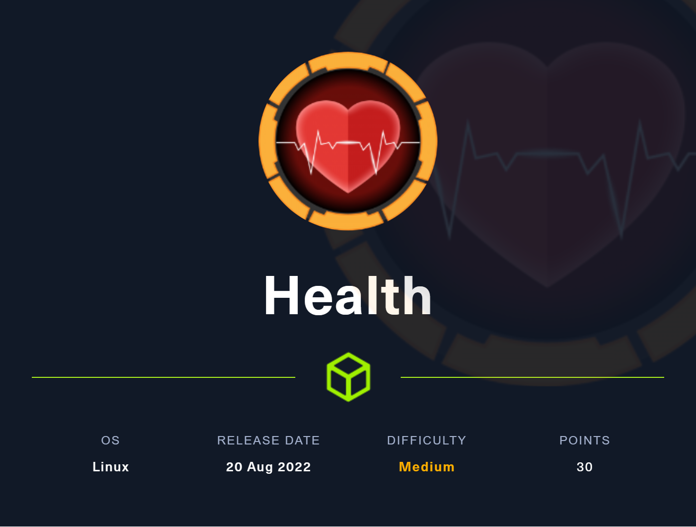

Une box Linux de difficulté Medium créée par [**irogir**](https://app.hackthebox.com/users/476556) qui demande une analyse pointilleuse de code, une imunité aux migraines dues à la cryptographie et beaucoup d'organisation pour regrouper toutes les éléments à chaque étapes. 

## Enumeration

### NMAP

Premièrement, on lance un scan Nmap de la machine hôte avec les scripts de détection par défaut pour trouver des ports TCP ouverts.

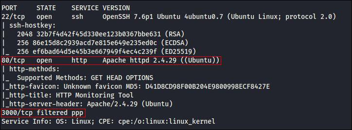

3 services:
- SSH sur le port 22
- HTTP sur le port 80
- PPP sur le port 3000

Le port 3000 est filtré mais nous pourrons y accéder d'une autre manière...

Concentrons-nous sur l'application Web qui tourne sur le port 80.

On arrive sur une application d'observation de la santé de services HTTP. Elle semble créer des tâches (programmable avec un système CRON) pour envoyer les informations de santé d'un service HTTP à une autre URL. 

La box n'a normalement accès qu'au réseau local. Voyons si l'application peut nous envoyer les informations de santé de notre machine attaquante à nous-même. 

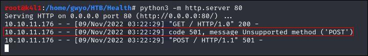

On voit bien qu'elle vient faire une requête GET mais échoue dans l'envoi de la requête POST.

Le [script python](https://gist.github.com/mdonkers/63e115cc0c79b4f6b8b3a6b797e485c7) qu'on va utiliser pour recevoir les informations gère les GET et les POST. Il écoute par défaut sur le port 8080.

Malheureusement, le pare-feu semble empêcher de faire des requêtes vers la cible directement via le WebHook.

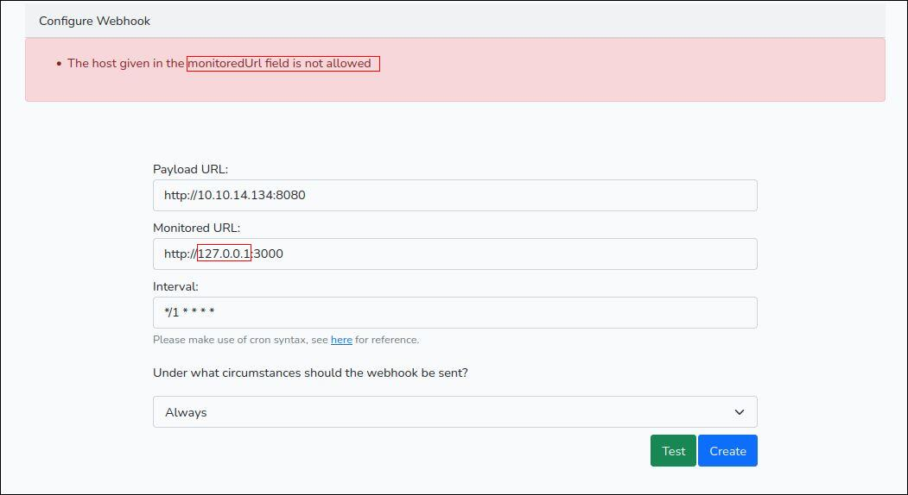

Un autre [script python](https://gist.github.com/shreddd/b7991ab491384e3c3331) va servir d'intermédiaire et rediriger les requêtes de notre machine vers port 3000 de la cible, auquel nous ne sommes pas censés avoir accès.

Maintenant, en observant notre port 80 et en envoyant (*/1 * * * * -> toutes les minutes) les infos sur notre port 8080...

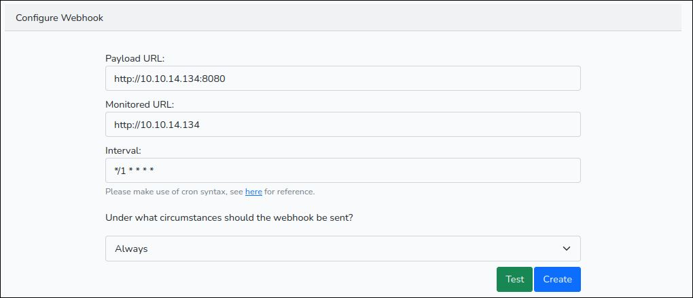

La requête est bien redirigée...

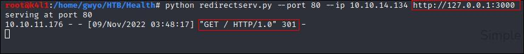

On obtient une page HTML et on apprend que le service qui tourne sur le port 3000 de la cible est, en fait, un service d'auto-hébergement Git développé en Go: Gogs pour Go Git Service.

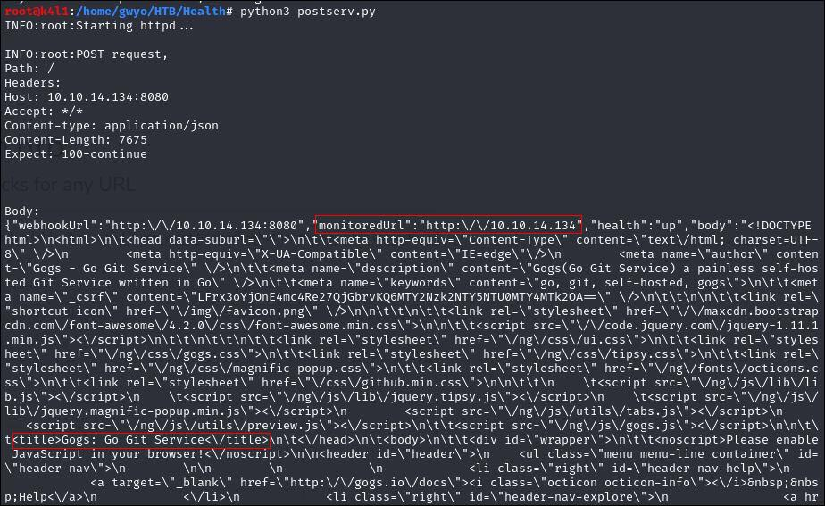

On essaye de formatter tout ça pour y voir un peu plus clair avec jq.

En supprimant au maximum les caractères en trop et en isolant le HTML, c'est beaucoup plus lisible. 

On est face à une version obsolète du projet (Gogs v0.5.5) qui a une vulnérabilité connue, une [Injection SQL](https://www.exploit-db.com/exploits/35238).
Modifions l'URL de redirection de notre serveur et essayons l'exploit tel quel pour voir...

Rien...

## EXPLOIT

Bon, il est temps de se plonger dans de la lecture de code (puisqu'il est opensource) pour comprendre la nature et la structure de la base de données dans le projet, puis de contourner les filtres sur les caractères d'espacement avec /**/.

L'API a un endpoint [**/users**](https://github.com/gogs/gogs/blob/v0.5.5/routers/api/v1/users.go) sur lequel appliquer l'injection.

Après beaucoup de tatonnements, on s'approche enfin des données dans la table [**user**](https://github.com/gogs/gogs/blob/v0.5.5/models/user.go).

Finalement, on arrive à retrouver des informations sur une utilisatrice **susanne**.

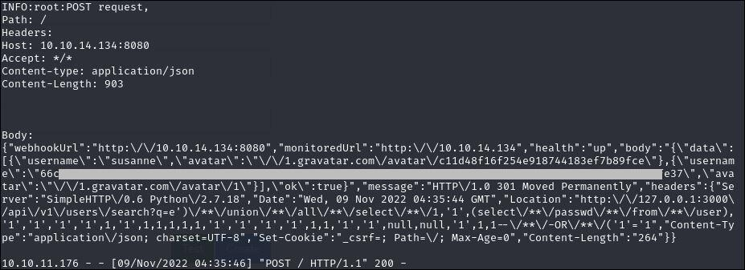

Le hash de son mot de passe.

Puis le grain de sel nécessaire au calcul du hash.

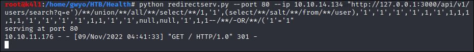

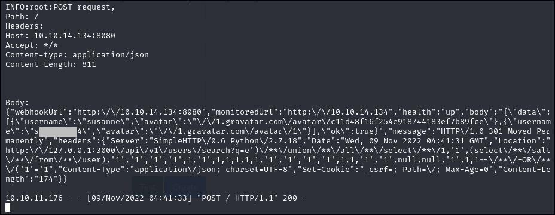

Maintenant, il faut mettre au bon format (utilisateur, hash, sel) pour permettre à hashcat de le cracker.

Le hash du mot de passe devra être passé de l'hexadécimal au binaire puis encodé en base 64.

`echo '[HASH]' | xxd -ps -r | base64`

Et le salt encodé en base64.

Pour hashcat, le hash doit être au format: `sha256:[ITERATION]:[BASE64_SALT]:[BASE64_HASH]` 

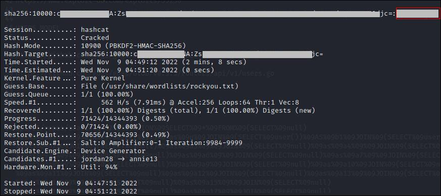

Et finalement, on arrive à obtenir le mot de passe de **susanne**.

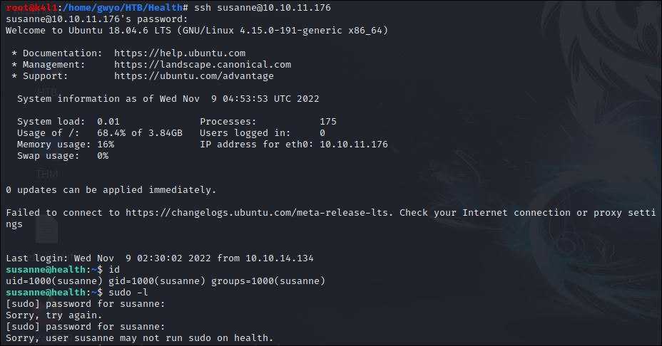

On se connecte en SSH avec ses identifiants.
A ce stade, on peut récupérer le flag **user.txt** qu'on a bien mérité.

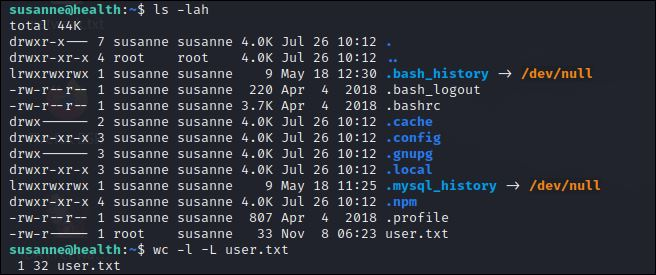

On continue à chercher sur la machine cible des fichiers intéressants et on tombe sur des identifiants pour se connecter à un service MySQL.

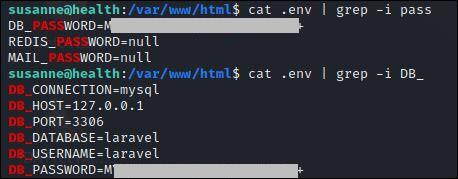

On s'y connecte et on regarde ce que contiennent les bases de données.

## PRIVILEGE ESCALATION

On y retrouve les tâches créées via l'interface Web de monitoring.

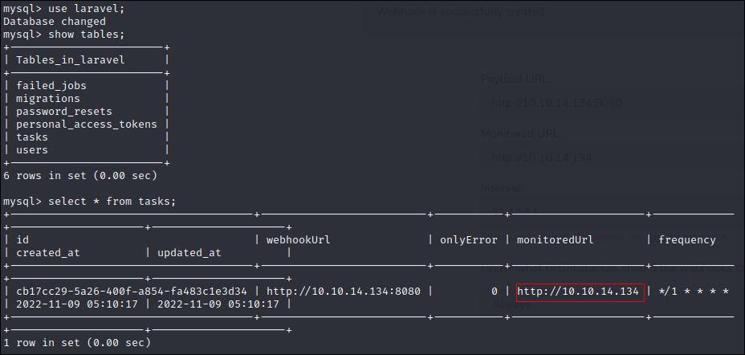

N'étant plus dépendants des filtres durant la création d'une tâche, on peut en modifié une existante pour exfiltrer des fichiers.

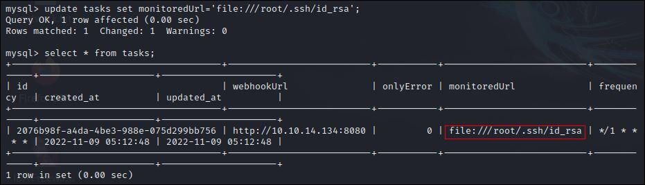

On change donc la valeur du champ **monitoredUrl** par le chemin du fichier de configuration SSH du compte **root** contenant la clé privée.

On la récupère via le serveur en écoute qu'on a mis en place [au début](#Post-Server)

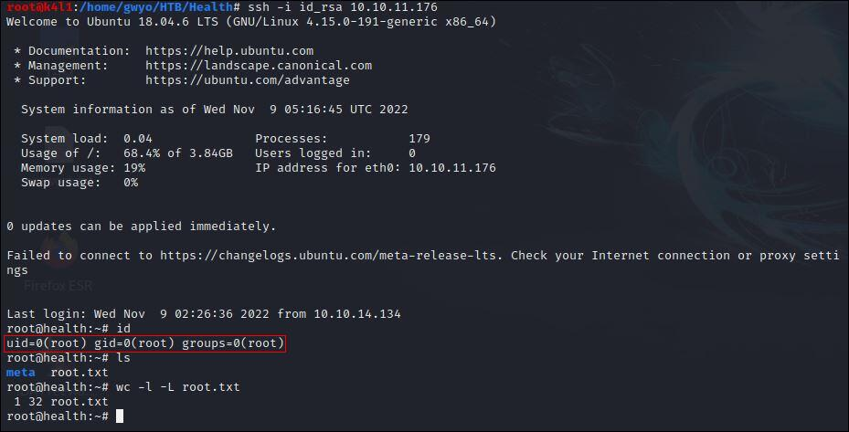

Le flag **root** est enfin à nous.

La partie inspection du code de Gogs et de documentation sur les différentes méthodes d'injection suivie du casse-tête crypto pour trouver le bon format m'ont largement sorti de ma zone de confort. 

Merci à [**irogir**](https://app.hackthebox.com/users/476556) pour cette box qui met la lumière sur des vulnérabilités qui commencent à dater sans être encore suffisamment documentées.

N'hésitez pas à aller lui donner du "respect" sur son profil si elle vous a plu.

## Liens:
- [Python Script HTTPd Server GET/POST](https://gist.githubusercontent.com/mdonkers/63e115cc0c79b4f6b8b3a6b797e485c7/raw/a6a1d090ac8549dac8f2bd607bd64925de997d40/server.py)
- [Python Script Redirect Server](https://gist.githubusercontent.com/shreddd/b7991ab491384e3c3331/raw/57a633529ce4f495aae25d6270b379f1d3ea6fd5/redirect.py)
- [GOGS v0.5.5 SQL Injection](https://www.exploit-db.com/exploits/35238)
- [GOGS v0.5.5 Source Code](https://github.com/gogs/gogs/tree/v0.5.5)
- [Profil HackTheBox de **irogir**](https://app.hackthebox.com/users/476556)

